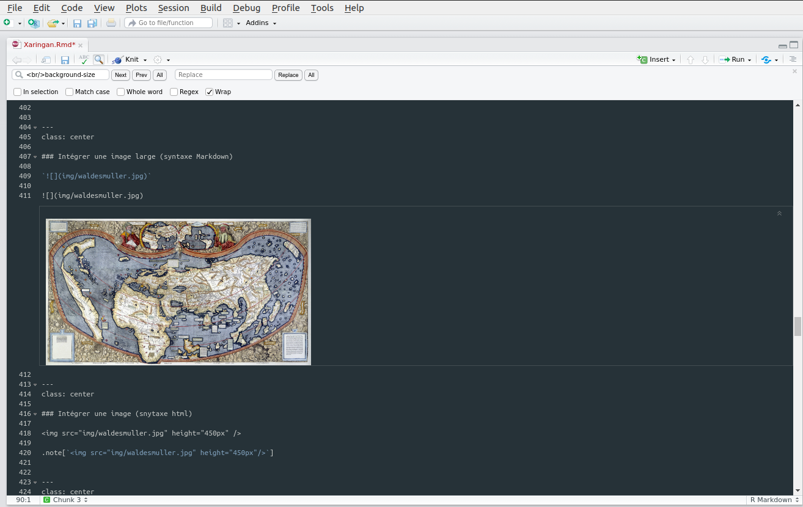
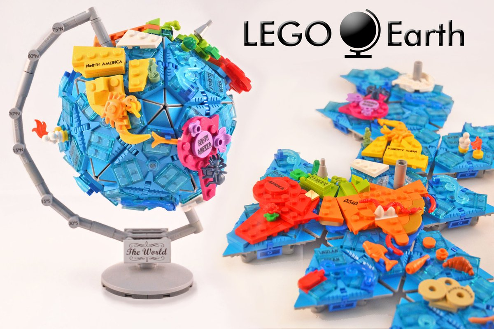
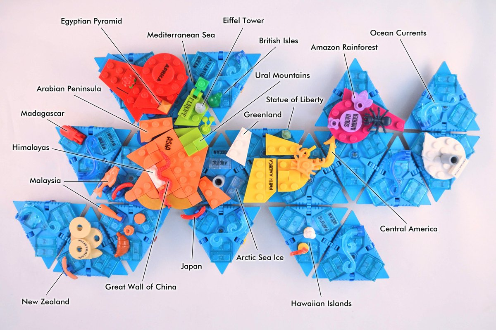
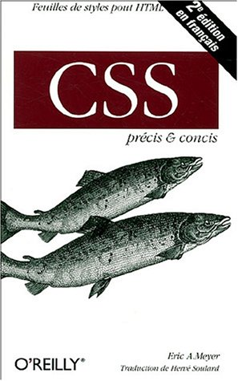
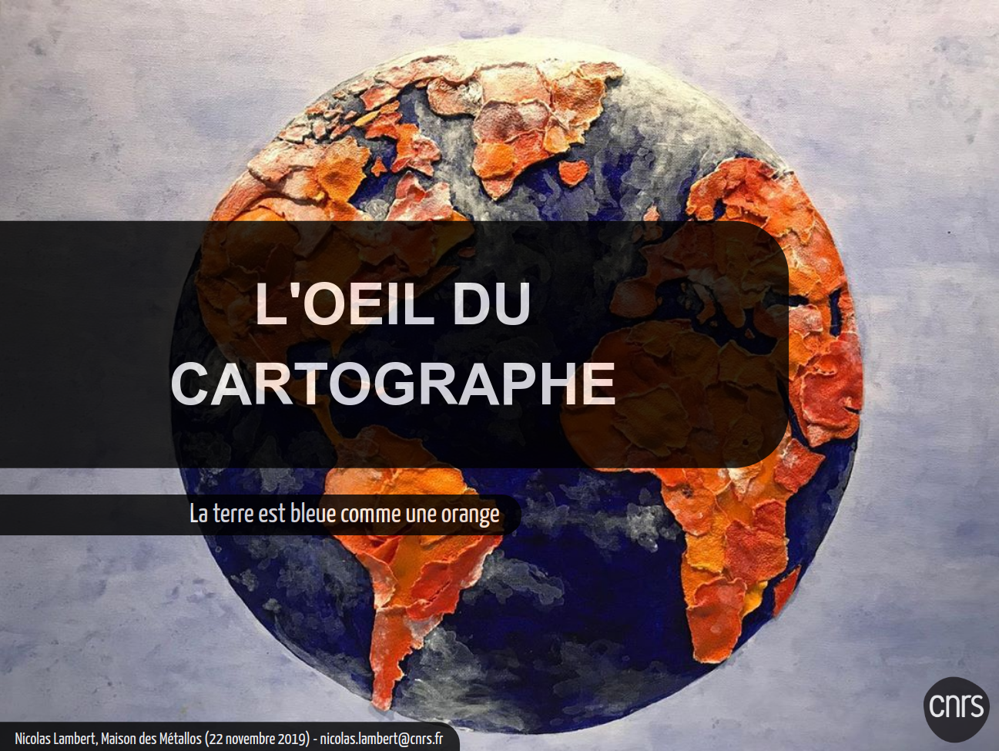
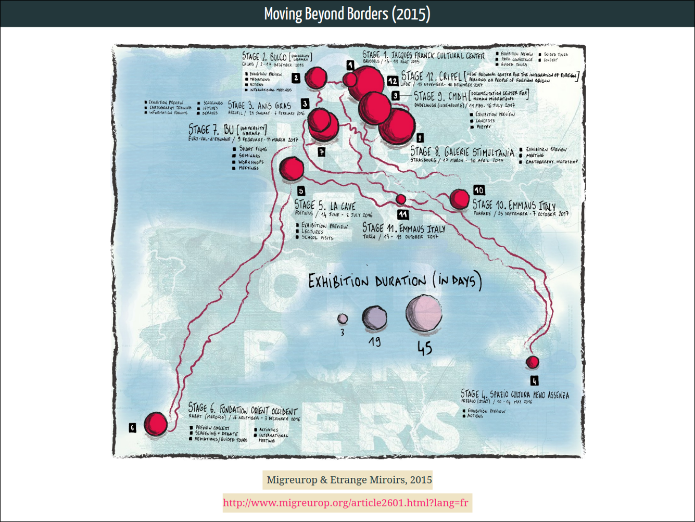
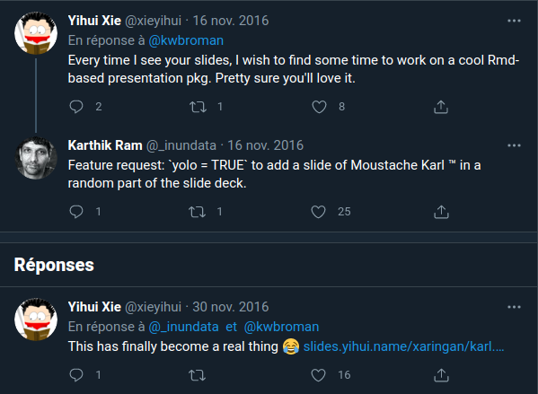

```{r setup, include=FALSE}
options(htmltools.dir.version = FALSE)
knitr::opts_chunk$set(
  fig.width=9, fig.height=3.5, fig.retina=3,
  out.width = "100%",
  cache = FALSE,
  echo = TRUE,
  message = FALSE, 
  warning = FALSE,
  fig.show = TRUE,
  hiline = TRUE
)
```

```{r xaringan-themer, include=FALSE, warning=FALSE}
library(xaringanthemer)
style_duo_accent(
  primary_color = "#1d3352",
  secondary_color = "#383838",
  inverse_header_color = "#ffae00",
  title_slide_background_image = "img/world-map-background-1024x668.jpg"
)

```

class: center
background-image: url(img/5dkw6g.jpg)
background-size: contain

---

# Les pour et les contre

## Avantages

- Tout se fait dans Rstudio
- Très adapté pour présenter du code
- Fichier texte léger facile à versionner (Github)
- Format web facile à partager (via Github ou Gitlab)
- Incite au partage public

--

## Inconvénients

- Prise en main compliquée
- Il faut changer d'habitudes de travail
- Si on connait un peu le html et le CSS, ça aide

---
class: center

<video controls src="img/presentation.mp4" height ="75%"></video>

---

# Xaringan

Le package **xaringan** (Xie, 2021) est une extension R Markdown basée sur la bibliothèque JavaScript **remark.js** (https://remarkjs.com) pour générer des présentations HTML5 plutôt cool. 

Le nom "xaringan" vient de Sharingan (Oeil Copieur Tournoyant) dans le manga et l'anime japonais "Naruto"

</img>

Reference : [https://yihui.org/en/2017/08/why-xaringan-remark-js/](https://yihui.org/en/2017/08/why-xaringan-remark-js/)

---
class: center

<video controls src="img/presentation2.mp4" height ="75%"></video>

---

# Structure d'un document xaringan

```{r, eval= FALSE}
---
title: "Presentation Ninja"
subtitle: "with xaringan"
author: "Yihui Xie"
date: "2016/12/12"
output:
  xaringan::moon_reader:
    lib_dir: libs
    nature:
      highlightStyle: github
      countIncrementalSlides: false
---

One slide.

---

Another slide.

```

---

# Paramétrer la présentation (entête yaml)

**seal** : pour désactiver la diapositive de titre (et donc pour en créer une personnalisée)

**self_contained: true**  : compliler la présentation dans un fichier unique (plus facile à partager ou passer d'un ordinateur à l'autre)

**chakra: libs/remark-latest.min.js** : télécharger la librairie *remark-latest.min.js* et a lier manuellement permet de travailler et présenter offline.

**autoplay: 30000** : permet de défilement automatique des slides. Ici, toutes les 30 secondes

**countIncrementalSlides: true** : affiche les numéros des pages au format n/N

**ratio: 16:9** : permet de définir la taille de la présentation. *Largeur:hauteur*

**etc..**

---

# L'entête de cette présentation

```{r, eval= FALSE}
---
title: "Présentez vos travaux en Markdown"
subtitle: "*Xaringan* et *Xaringanthemer*"  
author: 
  - "ÉCOLE THÉMATIQUE SIGR"
  - "Lambert, Giraud, Ysebaert"
date: '`r Sys.Date()`'
output:
  xaringan::moon_reader:
    chakra: libs/remark-latest.min.js
    self_contained: false
    css: ["xaringan-themer.css", "extra.css"]
    nature:
      slideNumberFormat: "%current%"
      highlightLines: true
      ratio: 16:9
      countIncrementalSlides: true
```

---

# Gestion des diapositives

Pour séparer les diapositives, on utilise **trois tirets ---**.

Pour ajouter des éléments de façon incrémentielle dans une diapositive, on utiise **deux tirets --**.

```{r, eval= FALSE}

---
  
# Titre de la diapo

text text text text.....

--

Nouvel élément

--

encore un élement

---

# Nouvelle diapo

```

---

# Des raccourcis clavier hyper utiles

### P (presentation mode)

### F (full screen)

### C (clone slides to a new window)

### B (black out)

### M (mirror the slide)

### H (help)

???

Mes notes ici : parler des raccourcis clavier ^^ 

Pour ajouter des notes, on utilise `???`

---
class: inverse center middle

# Présenter du code

---

# Présenter du code


Pour afficher du code, on l'écrit dans un chunk {r, eval= FALSE}

L'option highlightLines: true dans nature va surligner les lignes de code qui commencent par *, sont entourées de doubles accolades {{ }}, ou ont des commentaires en fn de ligne #<<:

--

```{r, eval= FALSE}
mtq <- mf_get_mtq()
mf_map(mtq)
mf_map(mtq, var = "POP", type = "prop")
mf_map(mtq, var = "MED", type = "choro")
mf_map(mtq, var = "STATUS", type = "typo")
```

---

# Présenter du code

Pour afficher du code, on l'écrit dans un chunk {r, eval= FALSE}

L'option highlightLines: true dans nature va surligner les lignes de code qui commencent par *, sont entourées de doubles accolades {{ }}, ou ont des commentaires en fn de ligne #<<:

```{r, eval= FALSE}
*mtq <- mf_get_mtq()
mf_map(mtq)
mf_map(mtq, var = "POP", type = "prop")
mf_map(mtq, var = "MED", type = "choro")
mf_map(mtq, var = "STATUS", type = "typo")
```

---

# Présenter du code

Pour afficher du code, on l'écrit dans un chunk {r, eval= FALSE}

L'option highlightLines: true dans nature va surligner les lignes de code qui commencent par *, sont entourées de doubles accolades {{ }}, ou ont des commentaires en fn de ligne #<<:

```{r, eval= FALSE}
mtq <- mf_get_mtq()
mf_map(mtq)#<<
mf_map(mtq, var = "POP", type = "prop")
mf_map(mtq, var = "MED", type = "choro")
mf_map(mtq, var = "STATUS", type = "typo")
```

---

# Présenter du code

Pour afficher du code, on l'écrit dans un chunk {r, eval= FALSE}

L'option highlightLines: true dans nature va surligner les lignes de code qui commencent par *, sont entourées de doubles accolades {{ }}, ou ont des commentaires en fn de ligne #<<:

```{r, eval= FALSE}
mtq <- mf_get_mtq()
mf_map(mtq)
*mf_map(mtq, var = "POP", type = "prop")
*mf_map(mtq, var = "MED", type = "choro")
*mf_map(mtq, var = "STATUS", type = "typo")
```

---

### Il n'y a pas que R dans la vie, il y a javascript aussi

#### Code R

```{r eval=FALSE}
ggplot(gapminder) +
  aes(x = gdpPercap, y = lifeExp, size = pop, color = country) +
  geom_point() +
  facet_wrap(~year)
```

#### JavaScript

```js
var fun = function lang(l) {
  dateformat.i18n = require('./lang/' + l)
  return true;
}
```

---
class: inverse center middle

# Les textes

---

# Big Topic or Inverse Slides `#`

## Slide Headings `##`

### Sub-slide Headings `###`

#### Bold Call-Out `####`

This is a normal paragraph text. Only use header levels 1-4.

##### Possible, but not recommended `#####`

###### Definitely don't use h6 `######`

---
class: center

## **gras**

`**gras**`

## *italic* 

`*italic*`

## ~~barré~~

`~~barré~~`

## <ins>souligné</ins>

`<ins>souligné</ins>`

---

### Citations

> This is a blockquote following a header.
>
> When something is important enough, you do it even if the odds are not in your favor.

```
> This is a blockquote following a header.
>
> When something is important enough, you do it even if the odds are not in your favor.
```

### Notes

.note[`.note[xxx] permet d'ajouter une note avec un style spécifique`]

### Liens

```{r, eval= FALSE}
[texte à afficher](http://lien_vers_la_page.html)
```

---
class: inverse center middle

# Les classes

---
### ---<br/>(defaut)

Lorem ipsum dolor sit amet, consectetur adipiscing elit. Nullam nulla nisi, lacinia quis dapibus ut, porta sit amet nisl. Nunc congue nisl vitae justo sagittis ultrices. Ut eu facilisis sem. Vestibulum blandit elementum nisi eu euismod. Nullam vitae tortor quis turpis sodales suscipit fermentum non ipsum. Etiam sodales justo eu gravida dictum. Cras non lectus id justo imperdiet pretium quis ut eros. Donec gravida ac arcu ut aliquet.

Mauris consequat euismod enim ut iaculis. Morbi condimentum rutrum justo, non sollicitudin augue. Praesent lobortis arcu vel lorem ullamcorper, et efficitur erat bibendum. Proin ullamcorper lectus quis nibh faucibus, et vestibulum augue bibendum. Nam venenatis dui neque, non egestas lectus dignissim a. Nulla cursus elementum arcu, eu eleifend nunc ullamcorper sit amet. In porttitor enim at bibendum sodales. Donec vel enim rutrum, porta ipsum at, tristique eros. Sed eu leo ac lorem sollicitudin molestie ac vel ipsum.

---
class: center

### ---<br/>class: center

Lorem ipsum dolor sit amet, consectetur adipiscing elit. Nullam nulla nisi, lacinia quis dapibus ut, porta sit amet nisl. Nunc congue nisl vitae justo sagittis ultrices. Ut eu facilisis sem. Vestibulum blandit elementum nisi eu euismod. Nullam vitae tortor quis turpis sodales suscipit fermentum non ipsum. Etiam sodales justo eu gravida dictum. Cras non lectus id justo imperdiet pretium quis ut eros. Donec gravida ac arcu ut aliquet.

Mauris consequat euismod enim ut iaculis. Morbi condimentum rutrum justo, non sollicitudin augue. Praesent lobortis arcu vel lorem ullamcorper, et efficitur erat bibendum. Proin ullamcorper lectus quis nibh faucibus, et vestibulum augue bibendum. Nam venenatis dui neque, non egestas lectus dignissim a. Nulla cursus elementum arcu, eu eleifend nunc ullamcorper sit amet. In porttitor enim at bibendum sodales. Donec vel enim rutrum, porta ipsum at, tristique eros. Sed eu leo ac lorem sollicitudin molestie ac vel ipsum.

---
class: right

### ---<br/>class: right

Lorem ipsum dolor sit amet, consectetur adipiscing elit. Nullam nulla nisi, lacinia quis dapibus ut, porta sit amet nisl. Nunc congue nisl vitae justo sagittis ultrices. Ut eu facilisis sem. Vestibulum blandit elementum nisi eu euismod. Nullam vitae tortor quis turpis sodales suscipit fermentum non ipsum. Etiam sodales justo eu gravida dictum. Cras non lectus id justo imperdiet pretium quis ut eros. Donec gravida ac arcu ut aliquet.

Mauris consequat euismod enim ut iaculis. Morbi condimentum rutrum justo, non sollicitudin augue. Praesent lobortis arcu vel lorem ullamcorper, et efficitur erat bibendum. Proin ullamcorper lectus quis nibh faucibus, et vestibulum augue bibendum. Nam venenatis dui neque, non egestas lectus dignissim a. Nulla cursus elementum arcu, eu eleifend nunc ullamcorper sit amet. In porttitor enim at bibendum sodales. Donec vel enim rutrum, porta ipsum at, tristique eros. Sed eu leo ac lorem sollicitudin molestie ac vel ipsum.

---
class: middle

### ---<br/>class: middle

Lorem ipsum dolor sit amet, consectetur adipiscing elit. Nullam nulla nisi, lacinia quis dapibus ut, porta sit amet nisl. Nunc congue nisl vitae justo sagittis ultrices. Ut eu facilisis sem. Vestibulum blandit elementum nisi eu euismod. Nullam vitae tortor quis turpis sodales suscipit fermentum non ipsum. Etiam sodales justo eu gravida dictum. Cras non lectus id justo imperdiet pretium quis ut eros. Donec gravida ac arcu ut aliquet.

Mauris consequat euismod enim ut iaculis. Morbi condimentum rutrum justo, non sollicitudin augue. Praesent lobortis arcu vel lorem ullamcorper, et efficitur erat bibendum. Proin ullamcorper lectus quis nibh faucibus, et vestibulum augue bibendum. Nam venenatis dui neque, non egestas lectus dignissim a. Nulla cursus elementum arcu, eu eleifend nunc ullamcorper sit amet. In porttitor enim at bibendum sodales. Donec vel enim rutrum, porta ipsum at, tristique eros. Sed eu leo ac lorem sollicitudin molestie ac vel ipsum.

---
class: bottom

### ---<br/>class: bottom

Lorem ipsum dolor sit amet, consectetur adipiscing elit. Nullam nulla nisi, lacinia quis dapibus ut, porta sit amet nisl. Nunc congue nisl vitae justo sagittis ultrices. Ut eu facilisis sem. Vestibulum blandit elementum nisi eu euismod. Nullam vitae tortor quis turpis sodales suscipit fermentum non ipsum. Etiam sodales justo eu gravida dictum. Cras non lectus id justo imperdiet pretium quis ut eros. Donec gravida ac arcu ut aliquet.

Mauris consequat euismod enim ut iaculis. Morbi condimentum rutrum justo, non sollicitudin augue. Praesent lobortis arcu vel lorem ullamcorper, et efficitur erat bibendum. Proin ullamcorper lectus quis nibh faucibus, et vestibulum augue bibendum. Nam venenatis dui neque, non egestas lectus dignissim a. Nulla cursus elementum arcu, eu eleifend nunc ullamcorper sit amet. In porttitor enim at bibendum sodales. Donec vel enim rutrum, porta ipsum at, tristique eros. Sed eu leo ac lorem sollicitudin molestie ac vel ipsum.

---
class: bottom right

### ---<br/>class: bottom right

Lorem ipsum dolor sit amet, consectetur adipiscing elit. Nullam nulla nisi, lacinia quis dapibus ut, porta sit amet nisl. Nunc congue nisl vitae justo sagittis ultrices. Ut eu facilisis sem. Vestibulum blandit elementum nisi eu euismod. Nullam vitae tortor quis turpis sodales suscipit fermentum non ipsum. Etiam sodales justo eu gravida dictum. Cras non lectus id justo imperdiet pretium quis ut eros. Donec gravida ac arcu ut aliquet.

Mauris consequat euismod enim ut iaculis. Morbi condimentum rutrum justo, non sollicitudin augue. Praesent lobortis arcu vel lorem ullamcorper, et efficitur erat bibendum. Proin ullamcorper lectus quis nibh faucibus, et vestibulum augue bibendum. Nam venenatis dui neque, non egestas lectus dignissim a. Nulla cursus elementum arcu, eu eleifend nunc ullamcorper sit amet. In porttitor enim at bibendum sodales. Donec vel enim rutrum, porta ipsum at, tristique eros. Sed eu leo ac lorem sollicitudin molestie ac vel ipsum.


---
class: middle center

### ---<br/>class: middle center

Lorem ipsum dolor sit amet, consectetur adipiscing elit. Nullam nulla nisi, lacinia quis dapibus ut, porta sit amet nisl. Nunc congue nisl vitae justo sagittis ultrices. Ut eu facilisis sem. Vestibulum blandit elementum nisi eu euismod. Nullam vitae tortor quis turpis sodales suscipit fermentum non ipsum. Etiam sodales justo eu gravida dictum. Cras non lectus id justo imperdiet pretium quis ut eros. Donec gravida ac arcu ut aliquet.

Mauris consequat euismod enim ut iaculis. Morbi condimentum rutrum justo, non sollicitudin augue. Praesent lobortis arcu vel lorem ullamcorper, et efficitur erat bibendum. Proin ullamcorper lectus quis nibh faucibus, et vestibulum augue bibendum. Nam venenatis dui neque, non egestas lectus dignissim a. Nulla cursus elementum arcu, eu eleifend nunc ullamcorper sit amet. In porttitor enim at bibendum sodales. Donec vel enim rutrum, porta ipsum at, tristique eros. Sed eu leo ac lorem sollicitudin molestie ac vel ipsum.

---
class: inverse middle center

### ---<br/>class: inverse middle center

Lorem ipsum dolor sit amet, consectetur adipiscing elit. Nullam nulla nisi, lacinia quis dapibus ut, porta sit amet nisl. Nunc congue nisl vitae justo sagittis ultrices. Ut eu facilisis sem. Vestibulum blandit elementum nisi eu euismod. Nullam vitae tortor quis turpis sodales suscipit fermentum non ipsum. Etiam sodales justo eu gravida dictum. Cras non lectus id justo imperdiet pretium quis ut eros. Donec gravida ac arcu ut aliquet.

Mauris consequat euismod enim ut iaculis. Morbi condimentum rutrum justo, non sollicitudin augue. Praesent lobortis arcu vel lorem ullamcorper, et efficitur erat bibendum. Proin ullamcorper lectus quis nibh faucibus, et vestibulum augue bibendum. Nam venenatis dui neque, non egestas lectus dignissim a. Nulla cursus elementum arcu, eu eleifend nunc ullamcorper sit amet. In porttitor enim at bibendum sodales. Donec vel enim rutrum, porta ipsum at, tristique eros. Sed eu leo ac lorem sollicitudin molestie ac vel ipsum.

---

### className[...]

On peut également attribuer des classes à n'importe quel élément d'une diapositive. La syntaxe est **`.className[content]`**. Il s'agit d'une fonction très puissante de remark.js. Cela permet de donner un style à n'importe quel élément d'une diapositive par le biais de CSS. Il y a quelques classes de contenu intégrées : **`.left[]`**, **`.right[]`** et **`.center[]`**.

<br/>

.left[**Contenu aligné à gauche**]

<br/><br/>

.center[**Contenu centré**]

<br/><br/>

.right[**Contenu aligné à droite**]


---

### pull-left[...] et pull-right[...] (50% - 50%)

.pull-left[Vivamus sed erat facilisis, rhoncus justo nec, semper tellus. Donec blandit tempor erat in finibus. Nullam nisl orci, dictum a sagittis id, lacinia vitae leo. Donec in cursus purus. Duis et tellus ac lectus sollicitudin tempus. Praesent sem velit, tincidunt in placerat vel, fermentum eget orci. Donec sed velit vulputate, congue augue ut, rutrum dui. In nec venenatis diam. Sed non ligula neque. Donec in lectus semper, convallis tellus nec, elementum sapien. Curabitur facilisis libero porttitor ante placerat, quis accumsan eros cursus.]

.pull-right[Vivamus vitae odio in nisi porttitor egestas. Sed auctor diam id enim porta, ac eleifend lorem iaculis. Duis sed nibh faucibus, volutpat est eu, euismod augue. Proin interdum enim vitae leo tincidunt fringilla. Nulla rhoncus sapien sem, eu rhoncus justo vulputate pellentesque. Proin sit amet turpis mauris. Nam venenatis augue id enim efficitur gravida. Phasellus lobortis nunc ut ultrices semper. Quisque malesuada, lectus ac fringilla commodo, tortor dui ornare lectus, sit amet facilisis mi odio id tellus. Nulla sed imperdiet risus. Nullam ultrices urna fermentum pharetra mollis. Nam congue sem eu dapibus consectetur. Nullam sed ex luctus, porttitor justo eget, placerat elit. Nullam sit amet tincidunt urna, ac venenatis sapien. Pellentesque tempus felis massa, rhoncus elementum eros pulvinar sit amet. Pellentesque ut nulla sit amet massa porta placerat.]


---

### left-column[...] et right-column[...] (20% - 80%)

.left-column[
Lorem ipsum dolor sit amet, consectetur adipiscing elit. Aliquam vel orci maximus, lobortis augue et, efficitur velit. Nam quis finibus urna. Cras gravida vestibulum euismod.]

.right-column[Vivamus vitae odio in nisi porttitor egestas. Sed auctor diam id enim porta, ac eleifend lorem iaculis. Duis sed nibh faucibus, volutpat est eu, euismod augue. Proin interdum enim vitae leo tincidunt fringilla. Nulla rhoncus sapien sem, eu rhoncus justo vulputate pellentesque. Proin sit amet turpis mauris. Nam venenatis augue id enim efficitur gravida. Phasellus lobortis nunc ut ultrices semper. Quisque malesuada, lectus ac fringilla commodo, tortor dui ornare lectus, sit amet facilisis mi odio id tellus. Nulla sed imperdiet risus. Nullam ultrices urna fermentum pharetra mollis. Nam congue sem eu dapibus consectetur. Nullam sed ex luctus, porttitor justo eget, placerat elit. Nullam sit amet tincidunt urna, ac venenatis sapien. Pellentesque tempus felis massa, rhoncus elementum eros pulvinar sit amet. Pellentesque ut nulla sit amet massa porta placerat.]

---

### Créez vos propres classes

Il est possible de creer ses propres styles. Ici, myclass[] est associé au style css .myclass{} dans le fichier local extra.css. En résumé, les possibilités de personnalisation sont infinies. 

<br/><br/><br/>

.center[.myclass[Mon nouveau style]]

---
class: inverse center middle

# Les layout

```
---
layout: true
# Titre de la partie
<hr/>
### élément récurrent
```

---
layout: true
# Titre de la partie
<hr/>
### élément récurrent

---

**Voici un premier contenu**

Lorem ipsum dolor sit amet, consectetur adipiscing elit. Vestibulum varius dui eget tortor dignissim sollicitudin. Aliquam tincidunt pharetra magna quis rutrum. Nulla consectetur sem justo, eu semper ligula feugiat quis. Nunc tempor feugiat odio a rhoncus. Maecenas eleifend id orci eget vehicula. Etiam vel volutpat dolor. Quisque venenatis, ligula nec consequat posuere, odio sem consequat tellus, eu finibus tellus dolor quis urna.

---

**Et voilà un second contenu**

In molestie neque quis quam finibus vestibulum. Donec cursus mi quam, at facilisis justo bibendum at. Proin semper ligula eget tempor feugiat. Vestibulum ante ipsum primis in faucibus orci luctus et ultrices posuere cubilia curae; Suspendisse ornare augue velit. In tempus lobortis tempus. Nullam pretium nunc ac ex varius laoreet. Quisque malesuada consequat pulvinar. Duis at sem id ante dapibus faucibus. Vivamus a facilisis odio. Etiam sit amet euismod lacus, tincidunt scelerisque tortor. Mauris eleifend rutrum vehicula. Etiam consectetur ac mi sit amet venenatis.

---
layout: false
class: inverse center middle

# Ajouter des images
```
Markdown ou html ?
```


---
class: center

### Intégrer une image large (syntaxe Markdown)

``


---
class: center

### Intégrer une image large (syntaxe Markdown)



---
class: center

### Intégrer une image (snytaxe html)


.note[``]


---
class: center

### Deux images en vis à vis

.pull-left[

]


.pull-right[

]

.footnote[<center>`.pull-left[] & .pull-right[]`]


---
class: center

.left-column[.right[
<br/><br/>** Une carte et une légende**<br/><br/>
Les Feuilletons de Ptolémée : Le Scandale de Mercator. Premier Feuilleton de Ptolémée, consacré à la projection de Gérard Mercator : vous ne verrez plus la carte de votre salon de la même manière !<br/><br/>Source : les Savoirs ambulants, 2020]]

.right-column[]

.footnote[<center>`.left-column[] & .right-column[]`]

---
class: center middle

background-image: url(img/kangnido.png)
background-size: cover

### <span style="color: #08335c">background-image: url(img/kangnido.png)
background-size: cover</span>

---
class: center middle

background-image: url(img/kangnido.png)
background-size: contain

### <span style="color: #08335c">background-image: url(img/kangnido.png)
background-size: contain</span>


---
class: center

background-image: url(img/map.gif)
background-size: contain

### <span style="color: white">Gif animé</span>

---


--


--


---
class: inverse center middle

# Dans une page web, il est possible d'intégrer tout ce qu'il est possible d'intégrer dans une page web<br/><br/>🤔

---
class: center

## Vidéo

<iframe width="896" height="504" src="https://www.youtube.com/embed/kRsF9S8JqBI" title="Waldo Tobler, Animated Cartography of Detroit, ca. 1970 frameborder="0" allow="accelerometer; autoplay; clipboard-write; encrypted-media; gyroscope; picture-in-picture" allowfullscreen></iframe>

---
class: center

## iframe

<iframe src="https://sigr2020.sciencesconf.org/" height="500" width="1000"</iframe>


---
class: center

## Leaflet

`````{r eval=TRUE, fig.height=5}
library(leaflet)
leaflet() %>% addTiles() %>% setView(-1.2489695165222745, 45.95151749498196, zoom = 17)
```

---
class: center

## Javascript

<div id="observablehq-map-a10e1d75"></div>
<div id="observablehq-viewof-k-a10e1d75"></div>

<script type="module">
import {Runtime, Inspector} from "https://cdn.jsdelivr.net/npm/@observablehq/runtime@4/dist/runtime.js";
import define from "https://api.observablehq.com/@neocartocnrs/world-elevation-line-map.js?v=3";
new Runtime().module(define, name => {
  if (name === "map") return new Inspector(document.querySelector("#observablehq-map-a10e1d75"));
  if (name === "viewof k") return new Inspector(document.querySelector("#observablehq-viewof-k-a10e1d75"));
  return ["drawLine"].includes(name);
});
</script>

---
class: inverse center middle

## Et bien sûr, toutes les sorties générées directement en R via le code inclus dans la présentation

---

# Tableaux

```{r}
tibble::as_tibble(mtcars)
```

---

# Tableaux

```{r}
knitr::kable(head(mtcars), format = 'html')
```

---

# Tableaux

```{r}
DT::datatable(head(mtcars), fillContainer = FALSE, options = list(pageLength = 4))
```

---

# Graphiques

```{r plot-example}
library(ggplot2)
(g <- ggplot(mpg) + aes(hwy, cty, color = class) + geom_point())
```

---

# Cartes

```{r eval=FALSE}
library(mapsf)
# import the sample data set
mtq <- mf_get_mtq()
# set theme
mf_theme("dark")
# plot administrative status
mf_map(
  x = mtq, 
  var = "STATUS", type = "typo",pal = c("aquamarine4", "yellow3","wheat"), lwd = .5,
  val_order = c("Prefecture","Sub-prefecture", "Simple municipality"),
  leg_pos = "topright",leg_title = ""
)
# labels for a few  municipalities
mf_label(x = mtq[mtq$STATUS != "Simple municipality",], var = "LIBGEO",
         cex = 0.9, halo = TRUE, r = 0.15)
# layout
mf_layout(title = "Administrative Status", 
credits = paste0("Sources: Insee and IGN, 2018\n",
"mapsf ", 
ackageVersion("mapsf")))
```

---

# Cartes

```{r eval = TRUE, message = FALSE,  echo=FALSE, warning = FALSE}
library(sf)
library(mapsf)
# import the sample data set
mtq <- mf_get_mtq()
# set theme
mf_theme("dark")
# plot administrative status
mf_map(
  x = mtq, 
  var = "STATUS", 
  type = "typo",
  pal = c("aquamarine4", "yellow3","wheat"), 
  lwd = .5,
  val_order = c("Prefecture",
                "Sub-prefecture", 
                "Simple municipality"),
  leg_pos = "topright",
  leg_title = ""
)
# labels for a few  municipalities
mf_label(x = mtq[mtq$STATUS != "Simple municipality",], var = "LIBGEO", 
         cex = 0.9, halo = TRUE, r = 0.15)
# layout
mf_layout(title = "Administrative Status", 
          credits = paste0("Sources: Insee and IGN, 2018\n",
                           "mapsf ", 
                           packageVersion("mapsf")))
```

---
class: inverse center middle

# Embellir et personnaliser les présentations

---
class: center middle

## Option 1 : apprendre le CSS

</img>

---
class: left

## Intégrer un ficher css

```{r, eval= FALSE}
title: "Faut-il se méfier des cartes ?"
subtitle: "Spoil : oui !"
author: "Nicolas Lambert"
institute: "CNRS / UMS RIATE"
date: "`r Sys.Date()`"
output:
  xaringan::moon_reader:
    chakra: libs/remark-latest.min.js
    lib_dir: libs
    nature:
      highlightStyle: github
      highlightLines: true
      countIncrementalSlides: true
    css:
      - default
      - default-fonts 
      - "libs/css/animate.min.css"
*     - "libs/css/lambert.css"
*     - "libs/css/lambert-font.css"
    seal: false
---
```

---
class: center middle



.note[Exemple de page de garde personnalisée]

---
class: center middle



.note[Exemple de slide personnalisé]

---
class: center middle

## Option 2 : xaringanthemer

```{r, eval= FALSE}
*library(xaringanthemer)
style_duo_accent(
  primary_color = "#449ac2",
  secondary_color = "#383838",
  inverse_header_color = "#ffae00",
  #background_image = "img/conception-fond-abstrait-blanc_23-2148825582.jpg"
  )
```

---
class: center middle

## Option 2 : xaringanthemer

</img>

---
class: center middle

## Option 2 : xaringanthemer

```{r plot-example-themed}
g + xaringanthemer::theme_xaringan(text_font_size = 16, title_font_size = 18) +
  ggtitle("A Plot About Cars")
```

---
class: inverse center, middle

# Aller plus loin

---
class: center

# xaringanExtra

```{r, eval= FALSE}
# install.packages("devtools")
devtools::install_github("gadenbuie/xaringanExtra")
```

> https://github.com/gadenbuie/xaringanExtra

---

## `Animate.css`

Animate.css est une collection populaire d'animations CSS. 

*use_animate_css()* est une fonction qui modifie automatiquement le CSS pour activer active l'animation entre les diapositives. 

On peut télécharger et appeler manuellement le fichier css animate, ou bien l'appeler via le package *xaringanExtra* comme suit :

```{r, eval= FALSE}
{r xaringan-animate-css, echo=FALSE}
xaringanExtra::use_animate_css()
```

`---
class: inverse, center, middle, animated, bounceInDown
`
---
class: center

<video controls src="img/animate.mp4" height ="65%"></video>

---

```{r xaringan-tile-view, echo=FALSE}
xaringanExtra::use_tile_view()
```

## `xaringan-tile-view`

### (Appuyer sur O pour Overview)

```{r, eval= FALSE}
{r xaringan-tile-view, echo=FALSE}
xaringanExtra::use_tile_view()
```

---

```{r xaringan-editable, echo=FALSE}
xaringanExtra::use_editable(expires = 1)
```

## `xaringan-editable`

```{r, eval= FALSE}
{r xaringan-editable, echo=FALSE}
xaringanExtra::use_editable(expires = 1)
````

## .can-edit.key-firstSlideTitle[Changez le titre de cette page]
Hello, .can-edit[world], bienvenue à Oléron

.can-edit.key-likes[
- premier truc
- deuxième truc
]

---

```{r xaringan-scribble, echo=FALSE}
xaringanExtra::use_scribble()
```

## `xaringan-scribble`

###(Appuyer sur S pour Scribble)

```{r, eval= FALSE}
{r xaringan-scribble, echo=FALSE}
xaringanExtra::use_scribble()
```

---

```{r xaringan-panelset, echo=FALSE}
xaringanExtra::use_panelset()
```

## `xaringan-spanelset`

```{r, eval= FALSE}
{r xaringan-panelset, echo=FALSE}
xaringanExtra::use_panelset()
```

---

.panelset[
.panel[.panel-name[R Code]
```{r panel-chunk, fig.show='hide'}
library(mapsf)
mtq <- mf_get_mtq()
mf_map(mtq,)
mf_annotation(
  x = c(711167.8, 1614764),
  txt = "Look!\nImportant feature\nhere!",
  pos = "bottomleft", cex = 1.2, font = 2,
  halo = TRUE, s = 1.5
)

mf_annotation(
  x = mtq[20, ],
  txt = "This is less\nimportant",
  cex = .7, font = 3, s = 1.3
)
```
]
.panel[.panel-name[Plot]
```{r eval = TRUE, message = FALSE,  echo=FALSE, warning = FALSE}
library(mapsf)
mtq <- mf_get_mtq()
mf_map(mtq,)
mf_annotation(
  x = c(711167.8, 1614764),
  txt = "Look!\nImportant feature\nhere!",
  pos = "bottomleft", cex = 1.2, font = 2,
  halo = TRUE, s = 1.5
)

mf_annotation(
  x = mtq[20, ],
  txt = "This is less\nimportant",
  cex = .7, font = 3, s = 1.3
)
```
]
.panel[.panel-name[Explanations]
ILorem ipsum dolor sit amet, consectetur adipiscing elit. Aenean pulvinar vehicula ultricies. Etiam facilisis nunc non augue consectetur, at mattis tortor scelerisque. Aliquam aliquam metus lorem, id consequat odio semper vitae. Cras tellus ligula, aliquet in pulvinar a, tempor eget ipsum. Maecenas facilisis non orci id vestibulum. Vivamus pulvinar lacinia tincidunt. Cras mattis nunc vel velit dapibus tincidunt. Proin mattis leo velit, at finibus metus consectetur sit amet. Praesent molestie libero a urna dapibus, vitae pellentesque quam ultricies. Cras ligula mauris, facilisis id elit nec, lobortis semper augue. Cras at sem ac felis accumsan faucibus quis a ligula.

Mauris sed metus vel arcu feugiat pulvinar. Nam ligula metus, sodales id dignissim eget, euismod vitae metus. Vestibulum fringilla libero ultricies ante egestas sollicitudin. Aenean velit turpis, tristique vel dui quis, convallis venenatis nisi. In ac elementum felis. Cras sit amet nunc lectus. Nullam volutpat porttitor lectus. Nulla facilisi. Aliquam molestie nisi vel neque sagittis, vitae lacinia mi feugiat. Aenean sed urna ligula. Phasellus ac viverra mauris
]
]

---

```{r xaringanExtra-search, echo=FALSE}
xaringanExtra::use_search(show_icon = TRUE)
```

## `xaringan-Extra-search`

### (Appuyer sur CTRL+F pour chercher)

```{r, eval= FALSE}
{` xaringanExtra-search, echo=FALSE}
xaringanExtra::use_search(show_icon = TRUE)
````

---


## Compte à rebours

```{r include=TRUE, warning=FALSE}
# devtools::install_github("gadenbuie/countdown")
library(countdown)
countdown(minutes = 10, seconds = 00, top = 0)
```
---
class: inverse center middle

# À vous de jouer !


---

# À vous de jouer

#### 1 - Créer une présentation xaringan et parametrez l'entête (nom, titre...)

> File > new file > R Markdown > From template > Ninja Themed Presentation

#### 2- Ajoutez ou modifiez des éléments

> Une image, du code R et son résultat, du texte (vous pouvez reprendre les éléments de la veille)

#### 3 - Personalisez le style avec xaringanthemer

#### 4 - Essayez le paramètre *yolo = true * 😁 

```{r, eval= FALSE}

output:
  xaringan::moon_reader:
*  yolo: true
```
> **Documentation** : https://bookdown.org/yihui/rmarkdown/xaringan.html

---
class: center middle

# Merci 

Slides créés avec les packages R

[**xaringan**](https://github.com/yihui/xaringan) et [**xaringanthemer**](https://github.com/gadenbuie/xaringanthemer)

grâce à [**remark.js**](https://remarkjs.com), [**knitr**](http://yihui.name/knitr), et [**R Markdown**](https://rmarkdown.rstudio.com).

<br/><br/>

.note[Nicolas Lambert, Ronan Ysebaert, Timothée Giraud, 2021]

---
class: inverse center middle

# yolo = true

😜 

---
class: center

Inspiré par une demande de fonctionnalité aléatoire provenant d'un tweet de Karthik Ram, (Data Science, Berkeley) **Xaringan::moon_reader** fournit une option nommée **yolo** (un acronyme de "on ne vit qu'une fois"). Si vous lui attribuez la valeur **true**, une photo de Karl Broman (avec une moustache datée du 15 Nov 2002) sera insérée dans une diapositive aléatoire de votre présentation.

</img>

Karl Broman est statistician et professor à l'university du Wisconsin–Madison. 

---
class: center

background-image: url("img/moustache.jpg")
background-size: cover


